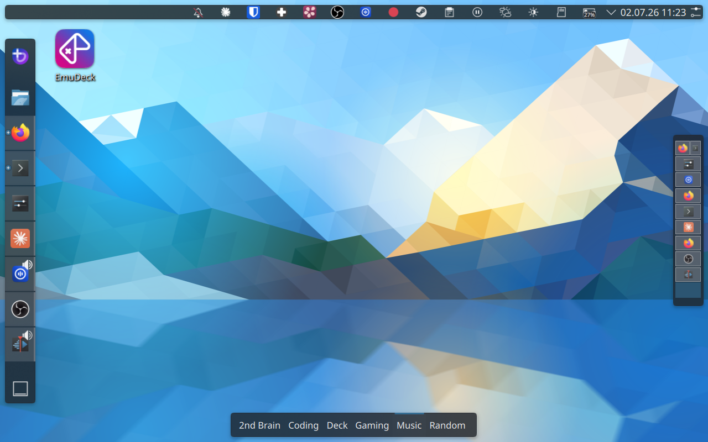

# Steam Deck Dotfiles

An opinionated KDE Plasma desktop setup tuned for the Steam Deck's screen size and input methods. Part of [Plasma Deckery](https://github.com/Plasma-Deckery/deckery).

The goal is a desktop that works well with a controller and no keyboard — clean, fast to navigate, and organised so you always know where things are.

## What it does

**Activities and workspaces** — KDE Activities keep different contexts separate (Coding, Gaming, Music, etc.). Each activity has its own virtual desktops, each holding one or two apps in tiling mode that automatically fill the screen.

<video src="docs/assets/tiling.mp4" controls autoplay loop muted></video>

**Window tiling** — [Kröhnkite](https://github.com/esjeon/krohnkite) provides dynamic window tiling so windows automatically arrange to fill the screen. [maximized-window-gaps](https://github.com/Plasma-Deckery/maximized-window-gaps) adds configurable gaps around tiled windows.

**Dynamic workspace management** — a KWin script ([Kyanite](https://github.com/Plasma-Deckery/kyanite)) ensures there is always one free desktop at the end of the list. Workspaces are created and cleaned up automatically.

<video src="docs/assets/desktopswitch.mp4" controls autoplay loop muted></video>

**Focus follows mouse** — moving the cursor to a window focuses it immediately, no clicking required.

**Voice input** — RNNoise PipeWire filter for noise suppression, works together with [OpenWhispr](https://github.com/OpenWhispr/openwhispr) for hotkey-activated speech-to-text.

→ [Full documentation](https://plasma-deckery.github.io/deckery/projects/steamdeck-dotfiles/)

## Using these configs

This repo contains personal dotfiles managed with [chezmoi](https://www.chezmoi.io/). The configs are not designed to be applied wholesale — they cover a full personal system setup and may overwrite unrelated settings.

If you want to adopt parts of this setup, browse the files directly and apply what's relevant to you manually. The documentation above explains what each piece does.
